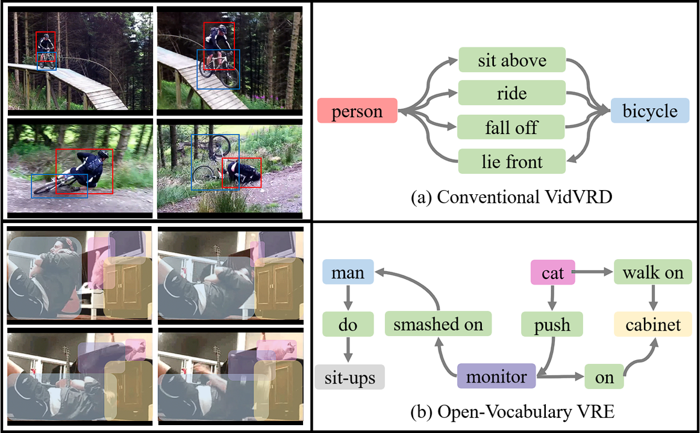

# OVRE: Open-Vocabulary Video Relation Extraction (AAAI24)

**Moments-OVRE** is a large-scale video relation dataset containing diverse 3-second videos from Multi-Moments in Time. Action in the video are densely annotated with corresponding relation triplets. We provide **Moments-OVRE** dataset and baselines in this repo.



## Data Preparation

Download [annotations](https://drive.google.com/drive/folders/1yZpXjeQt5m5sF7JNXL5WOhYlwcoFW0EB?usp=drive_link) to data/.

Raw videos can be download from http://moments.csail.mit.edu/. You can also send us an email: tianwt@m.fudan.edu.cn to obtain the extracted frames (~758GB).

## Usage

#### Requirement

```bash
git clone https://github.com/Iriya99/OVRE.git && cd OVRE
conda create -n ovre python=3.7
conda activate ovre
pip install -r requirements.txt
```

#### Training with fine-tuning of CLIP and GPT2

```bash
torchrun --nproc_per_node 8 main.py --epochs 50 --version patch
```

#### Testing

```bash
torchrun --nproc_per_node 1 main_patch.py --load_epoch 50 --bs 1 --mode test --version patch
python evaluation.py --result_path your_result_path
```


## Citation

If you use this code for your research, please cite:

```
@misc{tian2023openvocabulary,
    title={Open-Vocabulary Video Relation Extraction},
    author={Wentao Tian and Zheng Wang and Yuqian Fu and Jingjing Chen and Lechao Cheng},
    year={2023},
    eprint={2312.15670},
    archivePrefix={arXiv},
    primaryClass={cs.CV}
}
```
